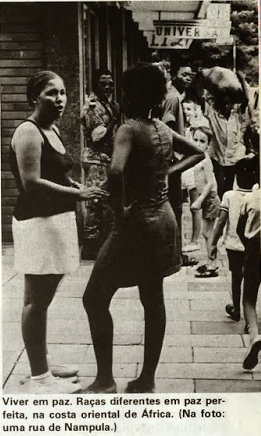

Title: Os Grandes Problemas Nacionais - Política Ultramarina
Date: 2013-12-17 12:13
Category: Ultramar
Tags: 'Luís Filipe Reis Thomaz', 'Observador', "problema ultramarino"
Author: Henrique
Original_Author: Luís Filipe Reis Thomaz
Original_Work: Observador de 19 de Outubro de 1973
Original_Work_Link: http://portadaloja.blogspot.co.uk/2013/12/o-ultramar-que-foi-nosso.html

><!-- PELICAN_BEGIN_SUMMARY -->Luís Filipe Reis Thomaz, a quem o Diário de Notícias chama o "Fernão Mendes Pinto do século XXI", assinava na Observador de Outubro de 73, um artigo sobre a política ultramarina, integrado na rubrica que a revista levava então a cabo, dedicada aos "Grandes Problemas Nacionais".

>Nele, oferece-nos o eminente orientalista uma abrangente exposição do problema ultramarino e da diversidade dos seus aspectos, compondo-nos o mosaico de especificidades que caracteriza tanto o problema como o próprio Ultramar. Um artigo excelente e informativo, do melhor que se fez outrora em Portugal; e que levanta algumas questões fundamentais, na verdadeira acepção dessa palavra, sobre Portugal. Ora, a posição de Portugal no Mundo era tão relevante então como agora; novos rumos precisam-se hoje mais do que nos últimos cinco séculos: *o problema da Nação Portuguesa* não se resolveu com a catástrofe do Ultramar, antes pelo contrário; alterou-se e assumiu contornos ainda mais graves e urgentes.
>Digitalizações do original devidos a mais um trabalho excepcional e, pode dizer-se, exclusivo, do José na [PortaDaLoja][1].
<!-- PELICAN_END_SUMMARY -->

[1]: http://portadaloja.blogspot.co.uk/2013/12/o-ultramar-que-foi-nosso.html

---

Se há na vida portuguesa problema que no presente momento se possa considerar crucial, esse é o do Ultramar. Crucial pelas implicações de que em todos os campos - economia, política interna, política externa, etc. - se rodeia; crucial, sobretudo, porque é o próprio destino da Nação Portuguesa - tal como hoje, na esteira de uma tradição secular, a concebemos - que está em causa. Difícil, por isso, de se abordar fria e objectivamente...

---

Afirma-se correntemente que o «Ultramar é a essência da Nação» - e, em certo sentido é verdade, pois a expansão portuguesa, o descobrimento, exploração e ocupação de domínios ultramarinos não é, na nossa história, um fenómeno lateral ou secundário, mas um aspecto central, à volta do
qual gravitam quase todos os demais.

Portugal sempre viveu entre a Europa e o Mundo: integrado na Europa, mas virado para o mundo. A própria geografia lhe parece ter determinado o rumo histórico: separado da Europa pela Espanha imensa e maciça, debruçado sobre o Oceano, o Criador assim o colocou: de costas para aquela e de frente para este...

Ao longo dos oito séculos da sua história, Portugal sempre viveu à margem dos grandes problemas, querelas e meandros da política europeia. Se nos dermos ao trabalho de folhear um compêndio de História Pátria (ou de o desfolhar na memória) notaremos que a quase totalidade das guerras e conflitos em que nos envolvemos foram guerras ultramarinas ou guerras quase domésticas com a vizinha Espanha - guerras ibéricas, não propriamente
europeias.

Os grandes conflitos da história da Europa - a Guerra dos 30 anos e a dos 7, a da Sucessão da Áustria e a da Espanha, como tantas outras - passaram-se ao longe; e, quando por excepção o nosso país foi levado a interferir, ou foi porque os azares da guerra nos trouxeram a luta para o pé da porta, pondo em risco a nossa segurança, ou porque a tal nos arrastaram os compromissos
assumidos - mormente a aliança com a Inglaterra, potência marítima por excelência, que foi, desde que perdemos o domínio incontestado dos mares, a garantia da segurança das nossas costas, da liberdade da nossa navegação e da nossa saída para o mundo.

Quando, terminada a Guerra da Sucessão de Espanha, as potências vencedoras distribuíram entre si o «bolo» conquistado, partilhando várias províncias da Europa, o prémio que o nosso pais, vencedor também, para si exigiu foi, muito longe da Europa, o reconhecimento das fronteiras do Brasil. Aliás, já desde o tempo do Prior do Crato que se pensava em estabelecer no Brasil a capital do reino.

D. João V, cheio de prestígio nas cortes europeias, foi, por mais de uma vez, convidado a intervir como árbitro em querelas entre diversas potências; mas sempre recusou imiscuir-se na política da Europa, preferindo concentrar sobre o Brasil os seus esforços, cuidados e atenções. Aos que estranharam a sua recusa em assumir um papel que só lhe daria prestígio e consideração, respondeu o soberano, com rara sagacidade, que era ali que estava o futuro de Portugal e não na Europa, pelo que o não podia comprometer, imiscuindo-se em querelas que lhe não diziam respeito - pois se aceitasse o papel de árbitro podia ser obrigado a empregar a força para garantir a sentença arbitral e ressalvar o seu prestígio.

O papel essencial dos portugueses na história da Humanidade foi o de medianeiros entre o mundo e a Europa: medianeiros na história da cultura, dando à Europa os primeiros conhecimentos sobre o Oriente, ao Oriente os primeiros conhecimentos sobre a Europa; medianeiros na história da civilização, caldeando hábitos, costumes, técnicas, misturando as raças; medianeiros na arte, intercambiando formas e gostos artísticos da Europa, da Índia e do Mundo Islâmico; medianeiros até na própria história natural, levando o coqueiro da Índia para o Brasil, o feijão e a mandioca do Brasil para a Ásia, o milho da América para a Africa e para a Europa.

Ora a história não é um passado morto, nem um mero somatório de acasos; quando ao longo de tantos séculos uma nação se mantém ininterruptamente fiel a determinado rumo é porque esse rumo lhe não foi traçado pelo acaso, mas por algo de mais profundo, mais forte e mais constante que não conseguimos, talvez definir, mas não podemos deixar de reconhecer e sentir.

Pode por isso dizer-se que o problema do Ultramar não é um problema que se põe à Nação Portuguesa, mas mais exactamente *o problema da Nação Portuguesa*; e não é um dilema simples: a prosseguir no rumo histórico que vem do passado - que, como todas as coisas da História, se não desenrola no vácuo, mas através de condições concretas que não são hoje as que foram ontem -, há que discutir por que caminhos; e, a iniciar novos rumos, haverá que repensar totalmente o nosso papel na história e a nossa posição no mundo...

####DE AVEIRO PARA TOMAR

Não é de admirar que problema de tamanha monta e de tão graves e complexas implicações seja discutido com paixão; não é de admirar, mas em certo sentido, é pena: as nações, como os indivíduos, nada perdem em reflectir sobre os seus problemas calma, lógica, objectiva e friamente - sem que, naturalmente, frieza signifique desinteresse, ou objectividade pragmatismo utilitário ...

A defesa incondicional do Ultramar tem sido o principal ponto de honra do actual Governo; não admira, portanto, que se vá tornando o grande cavalo-de-batalha dos seus adversários.

No Congresso da Oposição Democrática, reunido em Aveiro, a questão do Ultramar foi um verdadeiro *Leit-motiv* em numerosas teses. A posição que, incontestavelmente predominou foi uma posição extremista, expressa as mais das vezes com fanatismo e virulência: condenação da «guerra colonial» e da «exploração dos povos das colónias»; preconização de uma política de imediato abandono do Ultramar mediante entendimento com os chefes dos chamados «movimentos de libertação», para quem se transferiria a soberania das diversas províncias. É curioso notar que nestas propostas, embora feitas em nome dos ideais e princípios da democracia, pouco ou nada se falou em consultas à vontade popular - como se o facto de existirem em três das nossas províncias movimentos de guerrilha relativamente poderosos e bem organizados significasse que a vontade da maioria está com eles, ou como se o facto de terem recorrido à luta armada lhes garantisse a representatividade...

Houve, é certo, teses mais moderadas; mas é significativo que, de uma maneira geral, essas não tenham sido tão bem acolhidas, e que inclusivamente uma delas - por sinal apresentada por um ultramarino - tenha sido apodada de «fascista»...

Houve, por exemplo, quem propusesse que se abrissem amplas conversações, inquéritos e debates sobre o assunto, organizando-se em seguida um plano de acção, conforme com a opinião da maioria, que seria finalmente submetido ao País - Metrópole e Ultramar - por via de plebiscito. Transformar-se-ia a República Unitária em República Federativa, com sede em Lisboa, onde funcionaria um Governo e um Parlamento supervisor essencialmente nos aspectos militar, económico
e de política externa.

Houve também quem pusesse três hipóteses: construção de uma autêntica sociedade multirracial dentro do esquema do estado unitário - hipótese que foi considerada de difícil execução na prática; federação de estados autónomos, como solução definitiva ou como solução de transição para a terceira hipótese; e, finalmente, constituição de uma comunidade de estados independentes - hipótese que se reputou a mais racional.

Houve finalmente quem, sem tocar no aspecto das estruturas político-administrativas (por habilidade, ou por intuição do que parece ser, de facto, o cerne do problema?), tenha preferido incidir em aspectos sociológicos e de mentalidade. A «responsabilidade máxima pela questão colonial e pelo impasse colonial» foi atribuída à «mentalidade colonialista» - de que se deram como exemplos: a distinção entre dominadores e dominados, o privilégio dado a uma cultura, a discriminação racial (ao menos prática) na Administração, no Ensino Superior, etc.

Em Tomar, o uso da palavra foi partilhado entre o ministro do Ultramar, que expôs os pontos de vista do Governo, e diversos congressistas que apresentaram comunicações (num total de 75) sobre diversos problemas do Ultramar: educação e cultura (19 comunicações), política e administração (14), doutrinação, acção política e participação (13), desenvolvimento económico (7), trabalho e previdência (outras 7), etc.

Nem num caso nem nos outros se ouviu nada de substancialmente novo. A comunicação do ministro do Ultramar não pretendeu, aliás, nem fazer doutrina, nem traçar novos rumos no campo da política ultramarina - mas, dentro da linha até aqui seguida, axiomaticamente aceite, dizer o que pretende o Governo fazer no futuro. É esta a intenção expressa logo no inicio da comunicação: «Certos, pois, de interpretar o sentimento profundo do Povo Português e de que ao defender o Ultramar cumprimos um imperativo da Nação, aqui estamos para proclamar que não aceitamos teses derrotistas de abandono, que repudiamos propósitos de entendimentos que constituem verdadeira traição, que continuaremos no Ultramar, sem ceder, sem transigir, sem capitular na luta que lá se trava para defender da desordem, da destruição e da morte populações pacíficas e territórios em que estua pujante a ânsia de progresso. Aqui estamos para dizer com base no que já realizámos, que
havemos de continuar a tarefa colectiva de promover o seu desenvolvimento, de impulsionar o aperfeiçoamento cultural dos seus habitantes, de lhes criar condições de vida melhor.

Relembrados «os princípios a que a nossa acção tem obedecido e que a ela vão continuar a presidir» o ministro Silva Cunha abordou o problema da descentralização administrativa, consignado na última revisão constitucional, o da aplicação da reforma do ensino ao Ultramar, o da assistência e sanidade, detendo-se finalmente com mais demora no do desenvolvimento económico.

Quanto às comunicações apresentadas pelos congressistas, incidiram de uma maneira geral mais sobre problemas concretos do Ultramar que sobre as grandes linhas definidoras de uma política ultramarina. Houve assim quem falasse de habitação e de urbanismo, de saúde e assistência, de turismo e de política industrial - mas não foram objecto de discussão temas tão fulcrais como o das relações entre as culturas locais e a cultura nacional, o da articulação do direito costumeiro com a lei escrita, ou o das relações raciais ...

#####A consciência nacional e os problemas ultramarinos. 

Esta fuga aos aspectos fulcrais do problema não se verifica apenas no âmbito da ANP. É um fenómeno geral, e uma verificação que se impõe: embora o problema do Ultramar seja, no presente momento, sem dúvida o mais grave dos que afectam a vida nacional, a Nação não está preparada para o discutir em todas as suas implicações. Não o está devido a numerosos factores: devido às próprias implicações do problema; devido ao desconhecimento que geralmente reina sobre o Ultramar e muito particularmente sobre as suas populações, o seu pensar e o seu sentir; devido ainda - forçoso é reconhecê-lo - à maneira como o problema tem sido posto.

Com efeito, tem-se feito consistir essencialmente o problema do Ultramar na defesa do solo sagrado da Pátria e da unidade indiscutível da Nação - e canonizou-se *ipso facto* a política que em todos os sectores se tem seguido, como se todas as soluções concretas para todos os problemas concretos fossem tão indiscutíveis como a unidade da Nação, e todos os erros que no passado se cometeram tão sagrados como o solo sagrado da Pátria...

É verdade que se torna necessário manter a coesão moral da Nação à volta de uma guerra que, em três frentes, se prolonga há cerca de um decénio; é verdade que tal coesão não é compatível com a discussão sobre a legitimidade ou os objectivos dessa guerra - mas não há dúvida também que o monolitismo com que a questão é posta não contribui para que seja integral e perfeitamente compreendida em todos os seus complexos aspectos, em todas as suas imbricadas implicações. O *problema* do Ultramar obscurece assim e
eclipsa *os problemas* do Ultramar...

Isto é prejudicial. É prejudicial porque, como na sua comunicação em Tomar afirmou o prof. Silva Cunha, «as leis não valem por si, mas pela forma como são executadas». Afirmar que não são colonialistas os princípios que informam a nossa política, procurar, mesmo, eliminar das nossas leis os resíduos de colonialismo que ainda possam conter, de pouco servirá se não houver, ao mesmo tempo, um esforço de consciencialização e de autocrítica da parte dos que executam as leis. Ora a verdade é que, em maior ou menor medida, muitos dos europeus que vivem no nosso Ultramar estão ainda impregnados de preconceitos coloniais - e agem em conformidade.

Convém não esquecer que o problema do Ultramar se não reduz ao das superestruturas políticas; para o nativo que vive no mato, nos quadros estreitos da sua pequena comunidade tribal ou feudal, é sem dúvida muito mais importante a maneira como o administrador de posto o trata, ou o cantineiro o explora, que o estatuto político-administrativo da Província, aprovado pela Assembleia Nacional e publicado no Diário do Governo - coisas de que, com toda a probabilidade ignora a existência...

####DOS «SLOGANS» ÀS REALIDADES

As noções que o cidadão comum tem sobre política ultramarina provêm, essencialmente, de um número limitado de «slogans» ou frases-feitas, que, repetidas até à saturação, a todo o momento ouvimos. Sem pôr em dúvida que essas frases-feitas signifiquem verdades, e verdades importantes, temos de reconhecer que não podem representar senão verdades simplificadas - e, consequentemente, empobrecidas. No seu esquematismo apresentam a realidade como que estilizada - e encobrem, por conseguinte, a sua complexidade.

Não é possível, evidentemente, analisar aqui todos os casos em que isso se verifica; mas podemos aludir, brevemente, a alguns problemas fundamentais em que a realidade é bem mais complexa que as frases-feitas que circulam, e que, multas vezes, ocultam o cerne do problema.

#####Comecemos pela própria noção de Ultramar

Que é Ultramar? Desde os primeiros tempos, no século XV, que a expansão portuguesa se desenhou em três direcções distintas: conquista de praças no Norte de África, colonização das ilhas do Atlântico, exploração do litoral africano. Não se trata apenas de direcções geográficas diferentes, mas de tipos de expansão distintos: no Norte de Africa estamos perante um fenómeno essencialmente militar, impregnado do espírito de cruzada, guerreiro e cavaleiresco; nas ilhas do Atlântico perante uma colonização baseada na transferência de populações e numa economia essencialmente agrícola; na costa africana perante uma expansão puramente comercial, baseada na navegação costeira apoiada em terra por feitorias e fortalezas em que se faziam as trocas mercantis, sem praticamente haver fixação de populações. A segunda linha prolonga-se - nos métodos, no tipo de colonização, de economia e de estrutura administrativa - na colonização do Brasil; a terceira, na expansão no Oriente.

Sem nos embrenharmos pelos meandros da História, vejamos o que resultou desse fenómeno, complexo e multiforme desde o começo.

Nos Açores e na Madeira, colonizados quase exclusivamente com gente ida da Metrópole, e em que a semelhança do meio físico permitiu a transposição, quase sem adaptação, da civilização do continente, encontramos réplicas insulares da sociedade metropolitana - e, por isso, os dois arquipélagos são considerados ilhas adjacentes e não províncias ultramarinas.

Em Cabo Verde as condições aconselharam e a proximidade da costa africana facilitou um maior recurso à mão-de-obra escrava; a população é, por isso, racicamente híbrida; mas não há ainda uma sociedade culturalmente dual, pois sendo a população de origem europeia anterior à africana, e esta heterogénea, os quadros da sociedade e da cultura são europeus, e os elementos de cultura africana que subsistem não constituem uma estrutura, mas resíduos culturais nos quadros de uma cultura predominantemente europeia.

O mesmo se passa em S. Tomé - apenas com a diferença de que aí o elemento africano é rácica e culturalmente mais vultoso, e que à primitiva colonização, de carácter patriarcal, se sobrepôs no século XIX uma segunda colonização, de índole capitalista, que deu à sociedade local o aspecto que hoje a caracteriza.

No Oriente, pelo contrário, os portugueses encontraram civilizações constituídas, na sua maioria tanto ou mais evoluídas que a sua; a fixação de populações foi reduzida, de carácter quase exclusivamente urbano, e limitada a alguns centros principais - a presença portuguesa traduziu-se, por isso, essencialmente, numa assimilação religiosa e espiritual das populações, de que resultou um hibridismo cultural muito característico. Aqui, devido à fraca intensidade da colonização portuguesa, e ao contrário do que sucede em Cabo Verde e em S. Tomé, há um nítido predomínio das estruturas locais.

Algo de semelhante se passa na Guiné, que, embora tenha sido durante largos anos uma espécie de colónia de Cabo Verde, nunca se abriu verdadeiramente para a colonização europeia. 

Angola e Moçambique, finalmente, onde as dimensões e o carácter maciço do território obstaram durante séculos a uma penetração intensa no interior, abriram-se largamente, com a revolução industrial e técnica do século XIX, para a colonização branca: não uma colonização agrícola e patriarcal, como fora a das ilhas do Atlântico e a do Nordeste do Brasil no século XVI, mas uma colonização técnica, industrial, comercial, em grande parte de tipo capitalista. É nestas duas províncias que ocorre uma sociedade dual mais característica - pois coexistem lado a lado a sociedade europeia, essencialmente urbana, e a sociedade nativa tribal ou para-feudal, a cultura ocidental e as culturas locais, a economia comercializada e a de subsistência.

Se, verificada essa diversidade, quisermos dar uma definição de Ultramar, verificamos que é impossível fazê-lo: uma definição histórica, do tipo, terras descobertas e colonizadas a partir do século XV», não é válida, pois englobaria os Açores e a Madeira; uma definição etnológica, do tipo «terras em que a população e a cultura europeias se sobrepuseram a populações e culturas locais pré-existentes» não engloba Cabo Verde nem S. Tomé; e assim sucessivamente. Em última análise o Ultramar apenas pode ser definido como «aquilo que não é Metrópole». É pois pertinente perguntar de onde advém à Metrópole essa posição de privilégio que a distingue do Ultramar, e inquirir se não estaremos nesse ponto perante a sobrevivência de um preconceito colonial...

É grande a tendência para considerar o Ultramar corno um todo - não de um ponto de vista de complementaridade, que pressupõe a diversidade, mas de um ponto de vista de homogeneidade que não pode deixar de ser prejudicial. Se às diferenças de tipo de colonização, que anotámos, juntarmos as decorrentes da diversidade dos meios físicos e dos meios humanos pré-existentes à colonização portuguesa chegamos à conclusão de que há entre as várias províncias do Ultramar diferenças tanto ou mais profundas do que entre qualquer delas e a Metrópole. No século XVI, a essa diversidade real correspondia uma paralela diversidade de tipos de organização: sistema das capitanias-donatárias nas ilhas do Atlântico, idêntico sistema, mas sob a coordenação de um Governo-Geral no Brasil, sistema das feitorias-fortalezas no Oriente e na costa de África. Hoje (teremos recuado em vez de avançar?) impera um culto da simetria que tende a desprezar o condicionalismo concreto de cada província e a fazer tábua-rasa dos particularismos locais.

O reconhecimento desse particularismo repugna à nossa mentalidade legalista e geométrica. Não deixa de ser curioso notar como um texto tão importante como a «Lei de Terras do Ultramar» encara essa diversidade. É evidente que as concessões de terras não podem ter as mesmas dimensões em Angola e, por exemplo, em S. Tomé ou em Macau - e isto por uma razão muito simples: porque é incomensuravelmente diferente a densidade de população numa e noutras províncias e, consequentemente, muito desproporcionada a densidade de terrenos livres; a lei, porém, ao estabelecer um limite às concessões, num e noutro caso, não é para essa diversidade de condições que apela mas para o facto de umas serem províncias de governo simples, outras de governo geral...

Nesse como em muitos outros aspectos, uma província tão remota e de particularismo tão acentuado como Timor, ressente-se de se lhe aplicar uma legislação extensiva de facto a todo o Ultramar, mas concebida essencialmente para as necessidades e condicionalismos de Angola e Moçambique. E o mesmo se deve passar com as outras.

#####A descentralização

Estas considerações levaram-nos insensivelmente para um outro problema fulcral: o da descentralização política e administrativa. Do que acima exposto fica, facilmente se deduz que, de facto, se impõe - pelo que é escusado perdermos tempo a demonstrá-lo.

Pouco se ganharia, porém, se por descentralização se entendesse apenas a passagem de um sistema em que as Províncias Ultramarinas pendiam, inertes e sem iniciativa como chouriços no fumeiro, das mãos de um ministério do Ultramar macrocéfalo e todo-poderoso que as governava por telepatia, para um sistema em que pendam, com igual inércia, das mãos de um governador omnipotente, que da sua cadeira governe os céus e a terra, as coisas visíveis e as invisíveis...

É que se a descentralização é fundamental- essencialmente por razões práticas- mais fundamental ainda é a participação das populações na gestão das coisas públicas- por razões práticas, também, mas sobretudo por uma questão de princípio.

Não pode, portanto, deixar de se apreciar o desejo, que na recente revisão da legislação se nota, de dar maior relevo e importância às Assembleias Legislativas de cada província. Mas mais uma vez vamos parar ao mesmo ponto: as leis não valem por si, mas pela forma como são executadas - e até que em todas as províncias haja gente capaz de constituir assembleias efectivamente operantes e realmente representativas da massa da população local, há ainda um bom caminho a percorrer.

Quer-nos parecer, porém, que as bases de tal caminho não estão bem lançadas. A participação das populações na vida pública (ou a democracia, se assim preferirmos chamar-lhe) é muito mais exequível a nível de pequena comunidade local que a nível provincial ou nacional - pois a este último a complexidade dos problemas exige uma perspectiva do geral e uma versatilidade para que a maior parte das populações do Ultramar não está preparada. Se na nossa história buscarmos exemplos de instituições verdadeiramente democráticas, não acharemos outro senão o dos nossos concelhos medievais - enquanto a centralização operada em nome dos princípios liberais os não cilindrou completamente... De qualquer modo, parece evidente que não será fácil ter gente capaz de interferir activamente na vida pública a um nível superior, se aos níveis inferiores se lhes não oferece a experiência de uma participação activa. Ora o sistema de administração local vigente no nosso Ultramar - idêntico ao que ingleses e holandeses usaram nas suas colónias - caracteriza-se, de facto, senão de direito, por um paternalismo obsoleto que tolhe qualquer experiência de participação.

Vem a propósito observar que, se um sistema que concentra todos os poderes da administração local nas mãos de um administrador de posto ou de circunscrição é já de si discutível, mais grave é que, ao menos, se não procure dar a esses indivíduos uma preparação mais adequada. Em tempos reconheceu-se essa necessidade - e para o efeito foi criada a Escola Superior Colonial, mais tarde transformada em Instituto Superior de Estudos Ultramarinos, depois em Instituto Superior de Ciências Sociais e Política Ultramarina e hoje em «Faculdade de não se sabe bem o quê» da Universidade Técnica de Lisboa... Em vez, porém, de se caminhar no sentido de fazer passar por essa escola todos os candidatos ao quadro administrativo, e lhes ministrar assim uma preparação adequada, caminhou-se no sentido oposto - o da facilitação -, chegando ultimamente a dispor-se que os sargentos do Exército com uns tantos anos de serviço e mais algumas condições possam transitar, sem concurso, para o quadro administrativo, como se o facto de ter comandado uma secção de infantaria ou de ter sido amanuense de um regimento constituísse habilitação suficiente para as complexas e multímodas funções de um administrador de posto...

#####Integração racial

Se há aspecto da nossa actuação no Ultramar de que legitimamente nos possamos orgulhar é o da nossa tradicional política de não discriminação racial, que persistimos em seguir mesmo quando aos olhos da Europa tal aspecto era tido como «a vergonha do homem branco».

Se as relações entre diferentes raças no interior da comunidade nacional sempre foram de um modo geral cordiais, e os nossos territórios nunca foram agitados por lutas raciais como as que se observam por exemplo na América; se a nossa legislação sempre estabeleceu uma igualdade *de jure* entre os indivíduos de diferente cor de pele - isso não significa porém que se tenha já atingido uma perfeita igualdade de facto entre as diferentes raças. Basta notar que nunca houve (que se saiba) no Governo Central um ministro preto; e que, nas províncias, governadores pretos houve um - Honório Barreto - e, mesmo isso, há mais de 100 anos... Seria injusto atribuir este fenómeno a um premeditado e secreto intuito de discriminação - pois ele resulta essencialmente do desnível cultural e económico entre o elemento branco e o elemento negro da população nacional. Urge, pois, superar esse desnível - tarefa difícil e fatalmente lenta, mas a que nos não podemos furtar. O espectacular desenvolvimento que nos últimos anos a educação tem tido no Ultramar contribuirá, por certo, de modo decisivo, para a diminuição desse desnível; mas forçoso é reconhecer que é longo ainda o caminho a percorrer.

Convém, por outro lado, reduzir o problema, da integração racial às suas devidas proporções, e, sobretudo, não deixar que ele oculte um outro, mais subtil, mais profundo, quiçá mais grave: o da integração cultural.

Convém começar por observar que o problema racial é, em grande parte, o produto de um equívoco. Quando no limiar da «época moderna» as grandes navegações dos portugueses e dos espanhóis abriram o mundo à Europa e a Europa se derramou pelo mundo, os europeus entraram em contacto com povos de outras raças e de outras culturas. Desses povos, uns eram apenas de cultura diferente; outros, podemos dizê-lo, de cultura inferior - inferior por uma menor capacidade de organização, de diversificação, de criação, de domínio sobre a matéria. Ao verificar-se esse facto gerou-se a noção de «culturas inferiores». Restava encontrar uma explicação para tal inferioridade; e, quando a deviam procurar na história e na geografia, foram pedi-la à biologia - e, por uma errónea associação de ideias, estabelecendo uma relação de causa a efeito entre factos cuja ligação era meramente ocasional, criaram o conceito de «raças inferiores».

Tal conceito (e o racismo que dele é consequência) não teria porém sobrevivido e criado as fundas raízes que entre alguns povos criou se não tivesse recebido uma justificação e uma base aparentemente científica. Nos seus primórdios, a ciência etnológica ignorava a diferença entre a antropologia cultural e a antropologia física ou biológica. Os sábios do século passado pensavam poder reconstituir as linhas de difusão das antigas culturas medindo crânios... Ignoravam que as culturas se expandem sem respeitar fronteiras rácicas e que as raças se espalham adoptando diversas culturas. Hoje, no plano teórico, o problema das raças está definitivamente ultrapassado - e o racismo, onde subsiste, é um mero sentimento popular, que os políticos podem explorar num ou noutro sentido mas ninguém procura já justificar em teoria.

#####Integração cultural

O problema da integração das culturas é muito mais delicado. Uma integração perfeita, com efeito, não pode apenas consistir no reconhecimento de iguais direitos aos indivíduos de diferente raça, mas no direito de manterem dentro da comunidade nacional a sua personalidade étnica e a sua individualidade cultural. A realização deste desiderato esbarra, porém, com duas dificuldades: a primeira é o aparente conflito entre o pluralismo cultural e a unidade espiritual da Nação; a segunda a delimitação exacta da superioridade da cultura ocidental sobre as culturas locais do Ultramar. Ambos os problemas são demasiadamente complexos para que os possamos aqui discutir. Diremos contudo, quanto ao primeiro, que a unidade espiritual da Nação consiste mais numa unidade moral e histórica, resultante da consciência do passado vivido em comum e do sentimento de se constituir, de facto, uma comunidade, que de uma total uniformidade de cultura. Essa, a ser imposta, seria para as populações do Ultramar frustrante e alienante; para o conjunto nacional representaria um empobrecimento, pois destruiria uma complementaridade cultural, que é, sem dúvida nenhuma, um valor positivo. Um exemplo histórico como o da Suíça é sobre tudo isto deveras elucidativo. Quanto ao segundo, diremos que a noção de superioridade cultural se não aceita já em bloco, como outrora, e que cada vez mais se tende a reduzi-la a determinados aspectos, mormente ao campo da ergologia; tende-se, sobretudo, a considerá-la como mera superioridade actual e não como superioridade potencial.

Mas deixemos as teorias para passarmos a aspectos práticos. O respeito pela individualidade cultural das diversas etnias do nosso Ultramar está consignado na Constituição Portuguesa; não faltam também declarações a esse respeito nos textos e nos discursos em que o Governo tem definido a sua orientação política. A concretização desse princípio, porém, é ainda muito imperfeita. Focaremos três exemplos: o direito consuetudinário a educação, e as estruturas sócio-políticas.

O Estatuto do Indigenato - nitidamente inspirado nas doutrinas coloniais europeias, em boa hora abolido ao mesmo tempo que relegava os «indígenas» para uma posição de subalternidade jurídica e lhes não reconhecia a cidadania nacional, garantia-lhes o uso do seu direito costumeiro em tudo quanto se não opusesse à moral e ao direito natural. O Estatuto dos «vizinhos das regedorias» que o substituiu e permanece em vigor, embora abolindo a distinção jurídica entre indígenas e cidadãos, está imbuído do mesmo espirito de etnocentrismo, que é, em última análise, sobrevivência de uma maneira de pensar não totalmente emancipada de preconceitos coloniais. Com efeito, o estatuto não considera o direito consuetudinário das populações ultramarinas no mesmo  pé que a lei escrita: a manutenção daquele é considerada uma contemporização com «estado de desenvolvimento» ainda incompleto, e a opção por esta, considerada uma promoção, é irreversível. No espírito deste diploma é impossível não ver um retrocesso em relação ao da legislação elaborada e promulgada nos séculos XVIII e XIX no Estado da Índia - sem dúvida a parte do território nacional em que se aplicou a mais autêntica, actual e perfeita política de integração cultural.

No campo da educação, é bem notório o carácter europocêntrico do nosso ensino. Ora é absolutamente ilógico que num país que tem 24/25 da sua área fora da Europa, se dê ao estudo da geografia deste continente tanta importância como aos de todos os outros continentes reunidos; que um estudante de Macau aprenda as dinastias dos impérios egípcio, caldeu, persa e romano, mas nem uma linha sobre o império chinês; que um aluno do liceu de Timor aprenda a origem dos alanos, vândalos e suevos, mas desconheça a do seu próprio povo; e assim por diante.

Finalmente, no campo das estruturas socio-políticas, não podemos de deixar de notar que as estruturas locais estão completamente esmagadas pelas estruturas administrativas de origem e inspiração europeia. Ora, a experiência alheia ensina-nos que o estado de ebulição e anarquia em que se encontram hoje várias regiões da África (e até da Ásia, como o Vietname, sintomaticamente uma das regiões em que a colonização francesa foi mais infeliz) resulta, em boa parte, da destruição das estruturas locais pelas potências colonizadoras, que as tentaram substituir por estruturas exógenas, dificilmente adaptáveis ou funcionalmente muito menos operantes, mas na maior parte dos casos as destruíram simplesmente deixando no seu lugar o vácuo. É sabido ainda como a destruição dos enquadramentos sociais tradicionais é o caminho mais curto para a massificação da sociedade - que a subversão marxista procura alcançar como estádio intermédio necessário para a eclosão da revolução. Parece-nos, pois, que o revigoramento, renovação e rejuvenescimento das estruturas tradicionais deveria ser uma das principais coordenadas da nossa política ultramarina - mas é, infelizmente, aspecto em que pouco se fala. Apenas na Guiné se ouviu o general Spínola falar repetidamente na necessidade de «africanizar as estruturas» e «transformar as estruturas tradicionais em estruturas administrativas», sem que superior ou lateralmente se ouçam vozes de apoio a essa solução - que assim parece menos uma solução oficialmente desejada que uma solução tolerada para a situação, particularmente difícil, em que vive a Guiné.

Devemos, aliás, reconhecer que todas as iniciativas que o Governo queira tomar no sentido de uma integração despida de preconceitos etnocentristas, esbarrará, sem dúvida, com o obstáculo da mentalidade do vulgo. Para a maior parte das pessoas, com efeito, integração significa ainda assimilação, e assimilação a imposição de uma personalidade étnica metropolitana às populações do Ultramar - o que não seria integração mas autêntico colonialismo cultural.

#####As riquezas e o desenvolvimento do Ultramar
 
Um outro aspecto a que com frequência se alude, sem que sobre ele as ideias sejam sempre bem claras é o dos recursos e desenvolvimento económico do Ultramar. A alusão à «imensa riqueza», aos «ilimitados recursos» de Angola, por exemplo, tornou-se um verdadeiro lugar-comum. Não haverá, no tom em que se lhe alude, ainda acentuados vestígios daquela antiga concepção colonial do Ultramar como fonte de riqueza para a Metrópole?

O orgulho com que se fala da obra de Cabora Bassa, do empreendimento do Cunene ou das minas de Cassinga é perfeitamente legitimo e justificado. Mas o relevo que se dá a estes ou o outros empreendimentos particulares não envolverá o risco de fazer esquecer que o autêntico progresso consiste essencialmente na promoção social das populações, de que estes e outros empreendimentos não deverão ser se não meros instrumentos? Sabemos bem que no campo da promoção das populações é longo e difícil o caminho que falta percorrer. No campo da saúde e da educação muito se está fazendo; mas no da extensão rural, na melhoria dos processos de cultivo, no reordenamento agrário, no melhor aproveitamento dos recursos locais, na diversificação da alimentação, muito é ainda o que está por fazer. Em Angola têm-se feito importantes trabalhos nesse domínio, num trabalho de acção directa sobre as massas - mas é pena que a esses aspectos se não vá dando o relevo e a divulgação que se atribuem a outros empreendimentos mais espectaculares, mas talvez não de maior significado...

Ao pôr-se o acento sobre o desenvolvimento económico do Ultramar corre-se o risco de divulgar uma concepção tecnocrática e materialista da política ultramarina - concepção para que, às vezes, se parece estar escorregando. O fim último da acção governativa não é o desenvolvimento económico, nem mesmo o bem-estar dos cidadãos, mas a sua realização como homens e a sua felicidade - que não fica automaticamente realizada quando cada um tiver um frigorífico em casa e um automóvel na garagem. Moralmente - e até politicamente - a Justiça (no seu sentido mais lato) importa mais que o desenvolvimento, embora este possa contribuir para aquela. Reduzir o problema do Ultramar ao problema económico seria um erro talvez mais grave ainda do que reduzi-lo ao problema militar...

#####Portugal e o Terceiro Mundo

O colonialismo foi, como concepção política, rejeitado em todo o mundo. Portugal tem baseado a defesa da sua posição na demonstração de que a sua política não é colonialista, na afirmação de que não pratica qualquer espécie de racismo, na distinção entre os seus métodos de colonização e os praticados pelas restantes potências europeias. Sendo assim, não se compreende muito bem a nossa persistente recusa em condenar, nas assembleias internacionais, o colonialismo, o *apartheid* e práticas congéneres.

Entre Portugal e os países do Terceiro Mundo cavou-se assim (mais por iniciativa deles, é certo, mas também por nossa) um fosso difícil de colmatar - e tanto mais de lamentar quanto é verdade que, como acentuámos já, Portugal foi sempre mais um medianeiro entre a Europa e o mundo que um país europeu. Essa lamentável separação - verdadeira quebra no nosso rumo histórico secular - é, no presente momento, como todos bem sabemos, difícil de superar. Mas, mesmo assim, não deixa de ser lamentável que se continue a cultivar a animosidade e a desconfiança para com os países do Terceiro Mundo, a que tantos laços nos uniram no passado, e se não deixe perder uma ocasião de denegrir os seus Governos - como se para o meu
olho ser bom fosse necessário ser ruim o teu. É sintomática, por exemplo, a forma como a nossa televisão alude à seca no Senegal e no Mali, lançando as culpas do que se está passando para os respectivos Governos - acusação injusta, de uma falsidade e de uma falta de caridade em total desacordo com os princípios cristãos de que tanto nos ufanamos e, para mais, susceptível de ser utilizada contra nós: pois o Governo do Mali é tão responsável pela seca no seu território, como o Governo Português pela seca em Cabo Verde ...

Portugal poderia ser um medianeiro entre o Ocidente e os países do Terceiro Mundo; estes não o compreenderam ainda; e nós, a pouco e pouco, vamo-nos esquecendo - a troco apenas do prazer malévolo de dizer mal de quem não está de acordo connosco.

####E O FUTURO?

Sempre desejaram os homens conhecer o futuro; para isso, interrogaram, em tempos, a Pitonisa, os astros e as entranhas das aves; hoje interrogam a História. A História não pode desvendar ao homem o enigma do futuro; mas, na medida em que se repete - *nihil sub sole novum* - não deixa de ensinar ao homem alguma coisa. Vale, pois, a pena, meditar sobre ela, procurar aprender-lhe as lições, tentar adivinhar-lhe o sentido...

Há cerca de meio século, um alemão, Oswald Spengler, num livro célebre, A Decadência do Ocidente, procurou estabelecer leis para o nascimento, vida e morte das civilizações. Estudando em paralelo as diversas civilizações da História da Humanidade, e vendo que era semelhante o modo como apareciam, se desenvolviam, atingiam o apogeu, estiolavam e morriam, Spengler julgou poder estabelecer leis que lhe permitissem prever o futuro. Chegou assim à conclusão de que a nossa civilização cristã e ocidental estava à beira da agonia.

Depois dele, o grande pensador inglês Arnold Toynbee viu o problema com maior agudeza e mais profundidade; verificou que nada prenunciava a agonia e morte iminentes da civilização ocidental e previu para o mundo outro futuro: com o incremento da comunicação entre os povos que se sucedeu às grandes navegações dos séculos XV e XVI o mundo começou a caminhar, em passos cada vez mais rápidos, para o caldeamento de todas as civilizações, para a integração de todas as culturas.

Esta fase foi precedida de uma outra de supremacia da Europa sobre os outros continentes, de domínio dos europeus sobre os outros povos. A causa desse domínio foi a superioridade técnica, científica e económica da Europa sobre as demais partes do Globo. Desde o momento, porém, em que os outros povos tiveram acesso à mesma técnica e à mesma ciência, aquele domínio, perdido o seu principal fundamento, esbateu-se e desapareceu. O colonialismo representa por isso uma fase ultrapassada da vida do mundo, que os ventos da história, inexoravelmente, tendem a varrer. Os ventos da história sopram, com efeito, noutro sentido: no do caldeamento das civilizações, no da integração das culturas, no da igualdade entre os povos. Nesse caminho, não há dúvida-  e disso nos podemos legitimamente orgulhar - foram os portugueses quem deu os primeiros passos. A nossa expansão, pelo seu carácter integrador, foi a precursora dessa nova fase da história da humanidade.

5e assim é, como de facto julgamos ser, a nossa realidade nacional, pluricontinental, integradora e multirracial não está contra os ventos da História, mas a favor deles. Importa que o mundo o compreenda - mas importa, sobretudo, que em toda a sua amplitude o compreendamos nós também.

Integrado na Europa, Portugal não escapou, como não poderia ter escapado, à influência dos vários movimentos que se processaram no seio da cultura europeia - e, embora o carácter da nossa expansão tenha sido sempre integrador, a nossa política ultramarina não deixou de sofrer a influência das doutrinas coloniais em voga na Europa. Urge, por isso. um esforço colectivo de autocrítica, que elimine do nosso sistema tudo quanto possa ser vestígio obsoleto de uma fase já ultrapassada do devir do mundo.

Os princípios de integração rácica e cultural que nos orgulhamos de defender são, sem dúvida, no plano teórico, a única solução viável para os males deste pobre mundo, tão dividido pelo ódio e pela incompreensão entre os povos. Convém porém não esquecer que, conforme ao longo das linhas que precedem nos esforçámos por mostrar, a nossa integração rácica e cultural é um processo em desenvolvimento, não um facto consumado.

Na guerra que em três frentes sustentamos somos, sem dúvida, vítimas de uma conjuntura desfavorável e das ambições dos que, de fora, no-la movem e a sustentam; mas por certo que a subversão não teria atingido a amplitude que tomou se a propaganda adversa não tivesse encontrado nas populações reais motivações negativas a explorar, se no passado se não tivessem cometido certos erros. Alguns foram em boa hora corrigidos; os outros estamos, talvez, ainda a tempo de os corrigir.

####A DEFESA MILITAR

Esforçámo-nos por mostrar neste artigo que o problema do Ultramar se não reduz à defesa militar do solo pátrio e da integridade da Nação. Reconhecê-lo não é, de modo algum, minimizar o papel das Forças Armadas; pelo contrário: realçar a importância das tarefas que nos aguardam na paz é postular a presença do seu braço protector, como guardião da mesma paz.

Não se torna necessário referir aqui a sua actuação na defesa da integridade nacional - em que, conforme reconhecia até um dos congressistas que em Aveiro ergueu a voz contra a «guerra colonial», a maioria dos seus membros se tem «batido com galhardia e honestidade, preservando os sentimentos de honra da Nação». Mas é talvez oportuno relembrar o que tem feito pela promoção social das gentes do Ultramar, prestando assistência sanitária às populações, levando a escola aos lugares mais recônditos do mato, colaborando em numerosas outras missões de paz.

E vale a pena recordar ainda um outro aspecto: ao longo destes dez anos de guerra, milhares de jovens passaram pelas fileiras e tiveram ocasião de contactar directamente com as realidades ultramarinas e com os reais problemas do Ultramar. Esses não podem deixar de ser, no seio da Nação, um activo e importante elemento de consciencialização para o que é hoje o seu mais crucial problema.